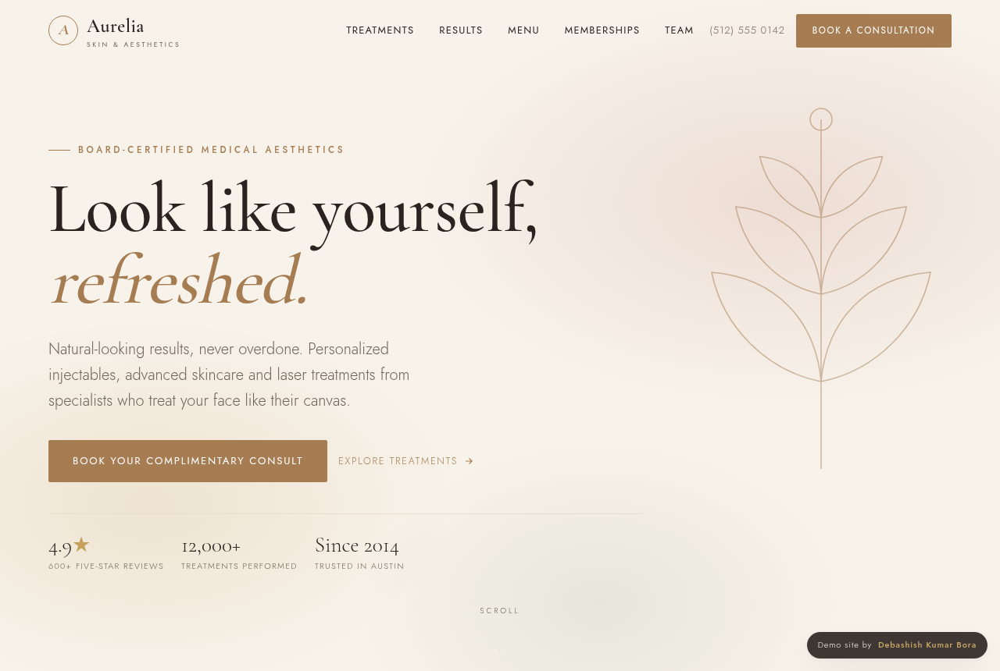
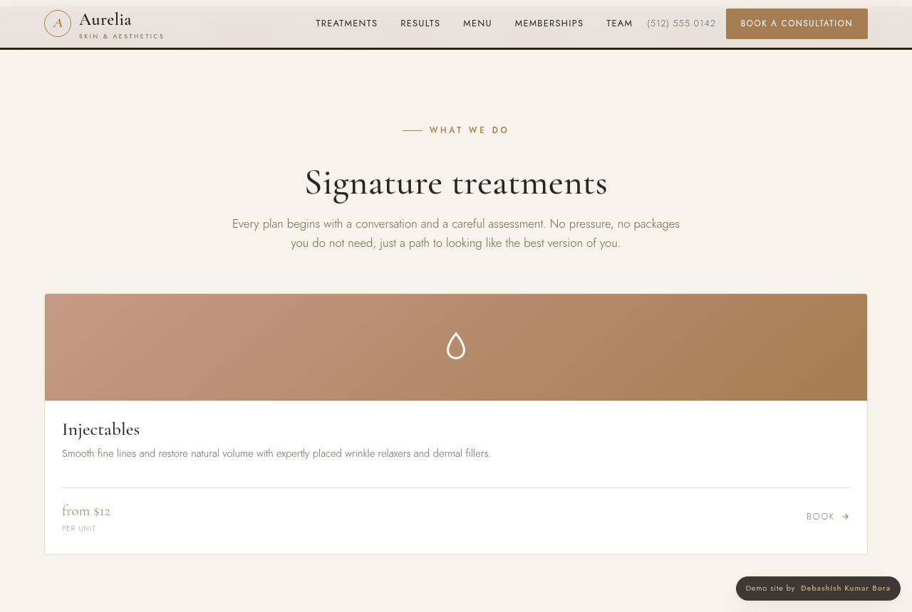
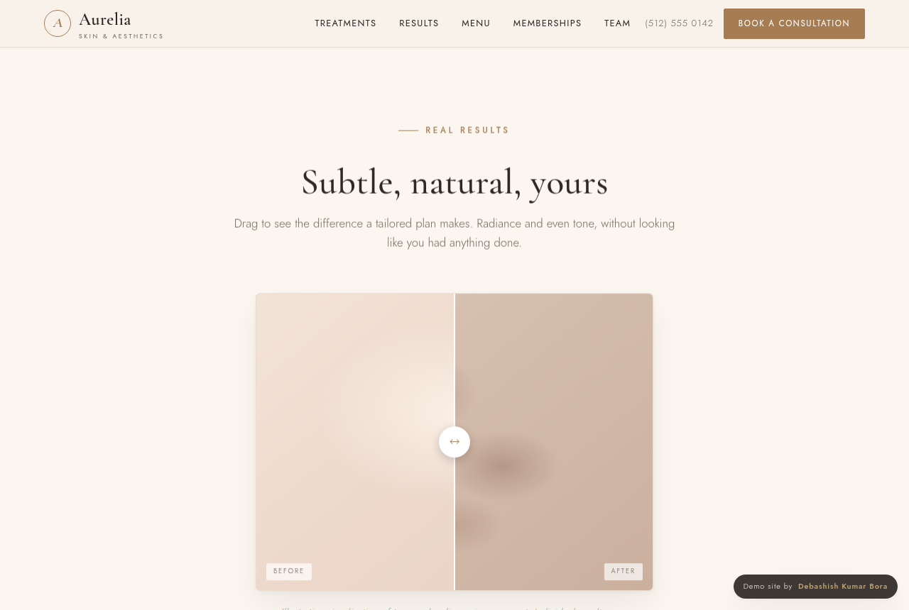
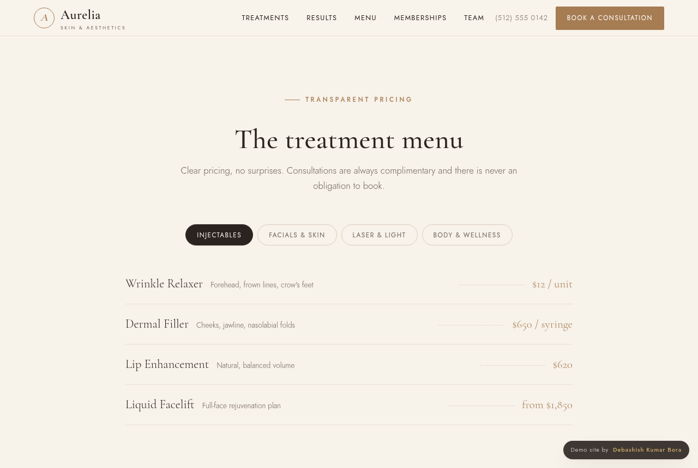
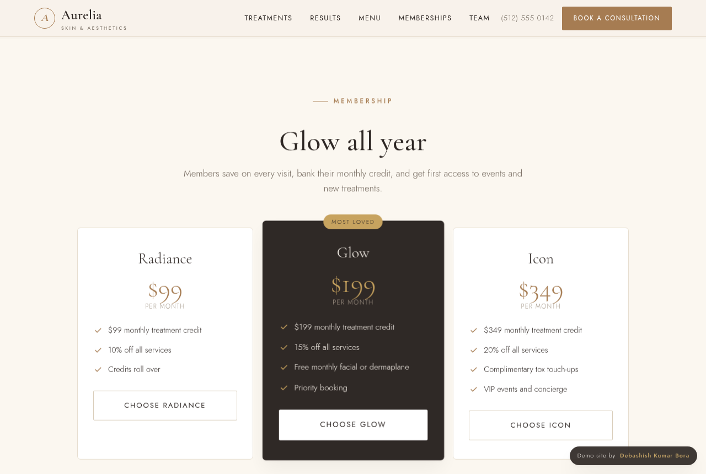
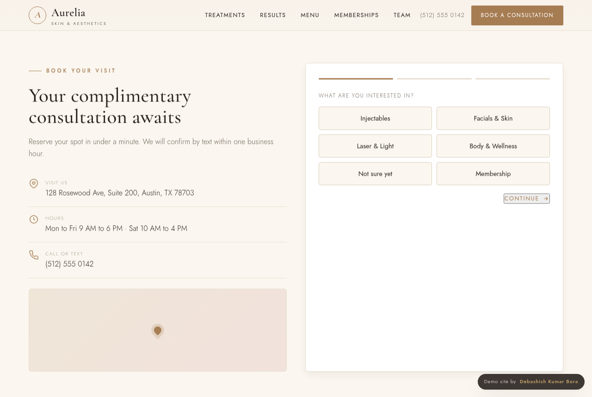
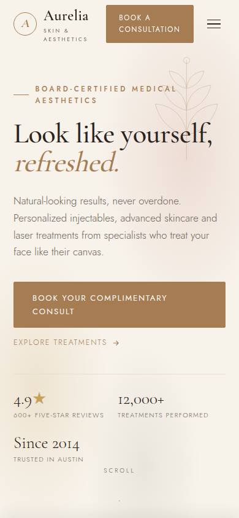

# Aurelia Skin &amp; Aesthetics, a premium med spa website

A conversion-focused, single-file website for a medical spa. It is built as a flagship portfolio piece *and* a template you can rebrand and resell to real aesthetic clinics, dentists-adjacent practices, and beauty businesses. **Aurelia** is a fictional brand created for the demo.

Med spas are one of the highest-value web design niches: design-forward, image-driven, and run by owners who happily invest $6,000 to $12,000 in a site because it is the first impression of the whole brand experience. This site is built to look like it belongs to a clinic charging premium prices.

## Why it wins the client

- **It looks expensive.** Warm-luxury palette (cream, espresso, soft bronze and blush), elegant Cormorant serif, generous whitespace. If the site looks cheap, clients assume the treatments are too. This one does the opposite.
- **It is built to convert, not just to look pretty.** A "Book a consultation" call to action is never more than a scroll away, pricing is transparent, trust signals are everywhere, and a guest can request an appointment in under a minute.
- **No stock-photo dependency.** Every visual is crafted in pure CSS and SVG (the botanical line-art, the abstract before/after, the gradient treatment cards, the monogram marks), so it loads instantly and there are no licensing costs. Drop in real photography later and it only gets better.

## What is inside

- **Signature treatments** grid (Injectables, Facials & Skin, Laser & Light, Body & Wellness) with from-pricing and book links.
- **Draggable before/after** slider, the signature med spa element, done as a tasteful abstract radiance visualization.

- **Tabbed treatment menu** with transparent pricing across four categories.

- **"Find your treatment" quiz**, a lightweight lead-gen tool: pick a concern, get recommended treatments and a book prompt.
- **Membership tiers** (Radiance, Glow, Icon), the recurring-revenue engine med spas love.

- **Meet the team**, **testimonials carousel**, and an **FAQ** accordion that handles the real objections (cost, downtime, looking overdone).
- **Multi-step booking flow** (treatment, timing, contact) with a friendly confirmation, plus location, hours and a map placeholder.

- **Sticky mobile "Book now" bar**, smooth scroll-reveal animations, and a full mobile layout.

## Make it a client's site in about 30 minutes

1. **Rebrand:** find-and-replace "Aurelia" with the client's name, swap the tagline and the monogram letter, update the address, phone, hours and menu prices.
2. **Recolor:** change a handful of CSS variables at the top (`--bronze`, `--blush`, `--sage`, `--gold`) to match their brand. The whole site re-themes.
3. **Add real photos:** replace the abstract before/after panels and the gradient card tops with the client's own images.
4. **Wire the booking form:** point it at their email, a Calendly link, or their booking system. (Right now it is a front-end demo that shows a confirmation.) This is also where your local/GBP and ads skills upsell naturally.
5. Remove the "Demo site by" credit badge for the client's live version.

## Tech

Single self-contained HTML file. Inline CSS and JavaScript, no frameworks, no build step, no backend, no paid services, no external images. Fonts: Cormorant Garamond + Jost. Mobile-first, verified zero horizontal overflow from 360px to 1440px, no JavaScript errors.

---

Built by **Debashish Kumar Bora**
Portfolio: https://debashishkumarbora.github.io
Email: debashishbora30@gmail.com
